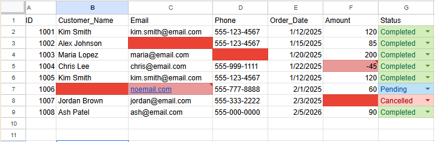
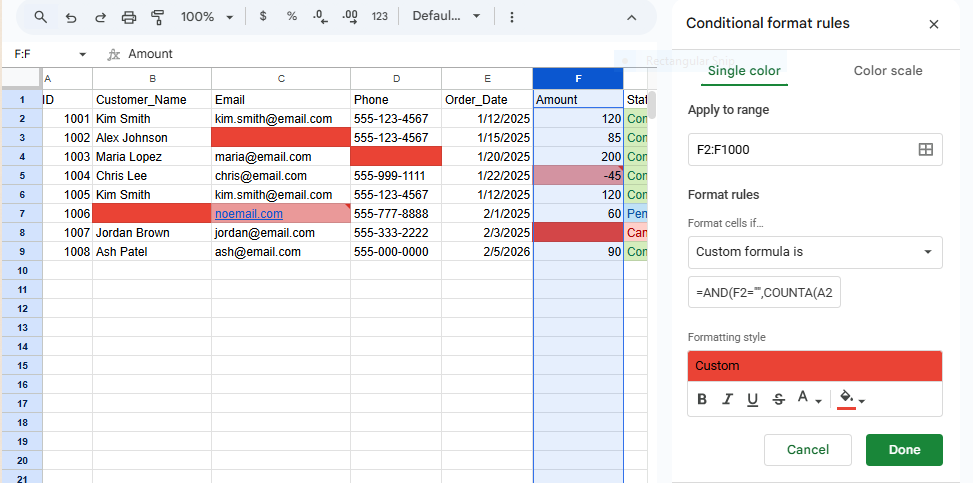
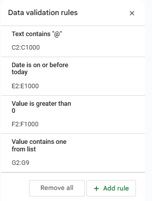
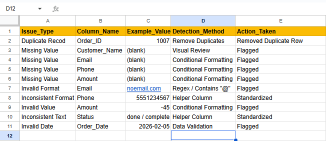

# Data Cleaning & Validation Project

## Overview
This project demonstrates data cleaning, validation, and data quality best practices using Google Sheets and Excel.

The dataset contains intentional issues such as missing values, duplicates, inconsistent formats, and invalid entries to simulate real-world business data.

## Tools Used
- Google Sheets
- Microsoft Excel

## Key Tasks
- Identified and documented data quality issues using an issues log
- Removed duplicate records
- Standardized phone numbers, dates, and status values
- Applied data validation rules to prevent future errors
- Used conditional formatting to flag invalid and missing data

## Files
- customer_orders_raw.csv – original dataset
- customer_orders_cleaned.xlsx – cleaned and validated data
- issues_log.xlsx – documented data quality issues

## Skills Demonstrated
- Data cleaning
- Data validation
- Data quality controls
- Documentation and attention to detail

## Screenshots

### Cleaned Dataset


*Final cleaned dataset with standardized formats and conditional formatting applied to highlight data quality issues.*

---

### Conditional Formatting

*Custom conditional formatting is used to flag missing or invalid values only when a record contains data, preventing false positives in unused rows.*

```excel
=AND(F2="",COUNTA(A2:E2)>0)

---

### Data Validation Rules


*Data validation rules applied to enforce allowed values, restrict invalid numeric entries, and prevent future-dated records.*

---

### Issues Log


*Structured issues log documenting identified data quality issues, detection methods, and actions taken.*


